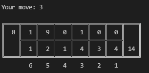

# Mancala #
by Kai Zhu

Version 0.7

An interactive Mancala game featuring a bot using the minmax algorithm, supports multi-threading.

### How to use ###

* To play against the bot, use playMancala.py and set AI depth (default 8)
* botvsbot.py tests a two implementations of the bot algorithm against each other.

### To-do ###
* Improve minmax implementation for "smarter" bot plays
* Implement GUI